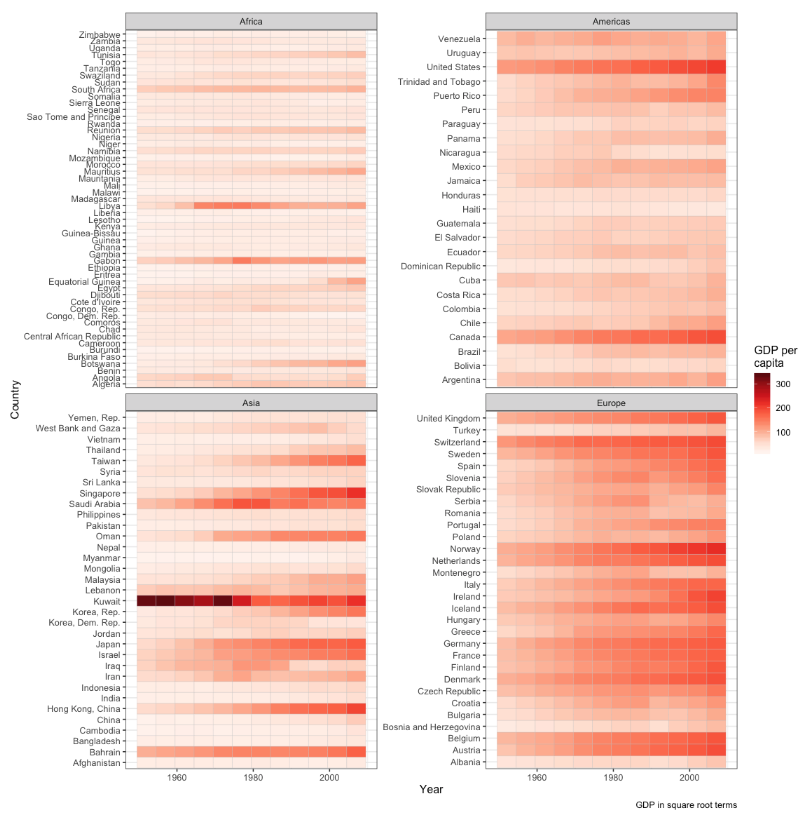

```{r setup, include=FALSE}
knitr::opts_chunk$set(echo = TRUE,
                      eval = TRUE,
                      message = FALSE, 
                      warning = FALSE,
                      comment = NA,
                      fig.width=8, 
                      fig.height=6)
```

## Introduction

First, focus on finishing your homework. If you have that done, choose a section
below where you would like some more practice. Below are some of the packages
you'll need.

```{r packages}
library(gapminder)
library(rjson)
library(tidyverse)
library(RColorBrewer)
```

## List subsetting

The JSON data on US senators is available at 
https://www.govtrack.us/api/v2/role?current=true&role_type=senator. We will 
read this in using a function from package `rjson`.

```{r}
json_file <- "https://www.govtrack.us/api/v2/role?current=true&role_type=senator"
senators <- fromJSON(paste(readLines(json_file), collapse = ""))
```

### Exercises

1. Print the structure for the first senator, Lamar Alexander, in the list.

2. Extract the birthday for each North Carolina senator.

3. Write a loop that prints the twitter ID for each senator in the leadership, 
   i.e. where `leadership_title` is not null.

*****

## Command line

Folder `organize-me` (see it in the `Files` pane) contains files 
you may have if you run a simulation on a high performance computer. 
Organize folder `organize-me` using the command 
line according to the following rules:

- delete all `.input2` files,
- remove the `flags` folder and all of its contents,
- place the test data text files in a folder named `test-data`,
- place the `.sh` files in a folder named `shell-scripts`,
- place the `.R` files in a folder named `R-scripts`,
- place the `.qsub` files in a folder named `hpc-run`,
- change the name of folder `organize-me` to `simulation`.

*****

## Data frame manipulations

```{r view-data}
gapminder
class(gapminder)
```

We'll create an object named `gapminder_df` that only has class `data.frame`.
Hence, we remove class `tbl_df` and `tbl`.

```{r class-change}
gapminder_df <- gapminder
attr(gapminder_df, which = "class") <- "data.frame"
class(gapminder_df)
```


Object `gapminder` has six variables:

- **country**: country of the world, factor
- **continent**: continent of the world, factor
- **year**: year, integer
- **lifeExp**: median life expectancy, double
- **pop**: population, integer
- **gdpPercap**: GDP per capita, double

### Exercises

For exercises 1 - 5 perform the task using both `gapminder` and `gapminder_df`.
Focus on the differences in results between the two data 
frames to get a better understanding of the tibble object. 

1. Extract the third row.

2. Extract the third column.

3. Extract the third column so the result is a data frame.

4. Extract the first and last columns.

5. Extract the last 20 rows without using the fact that you know there are
   1704 rows of data.

6. What years are in the data set? *Hint:* `unique`.

7. How many countries since 1960 had a median life expectancy of at least 80?

8. Create a new variable named `pop_scale` for `gapminder_df` that is defined
   as `pop / 10000`.
   
9. What was the mean life expectancy for Europe in 1957? How about in 2007?

10. Which country had the highest median life expectancy in 1957? How about in
    2007?

*****

## `ggplot2`

### Exercises

1. Use `gapminder` to try and recreate the plot below.
   <br/><br/>
   Non-obvious plot features
    
    - Filter `gapminder` so it does not contain `Oceania`
    - `colors = brewer.pal(9, "Reds")`



2. Once you have the plot recreated, try to improve the visualization. 


